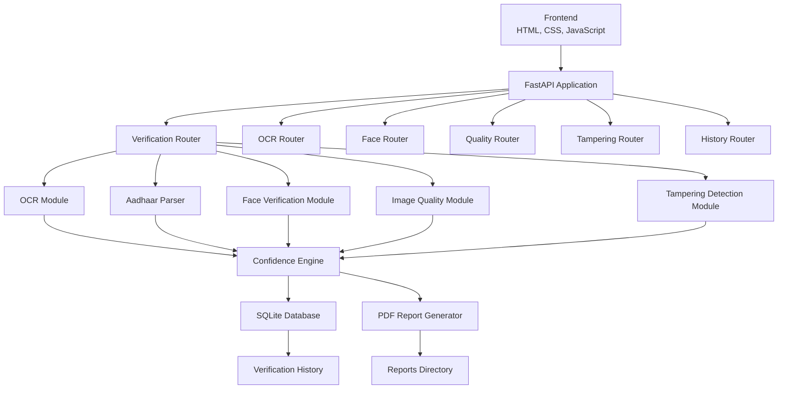
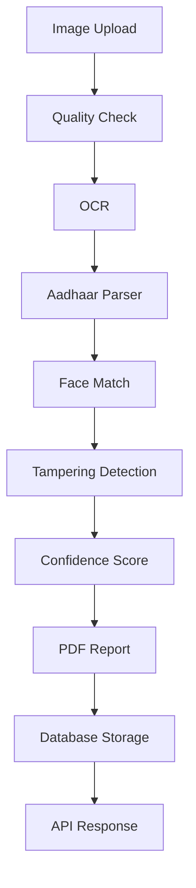
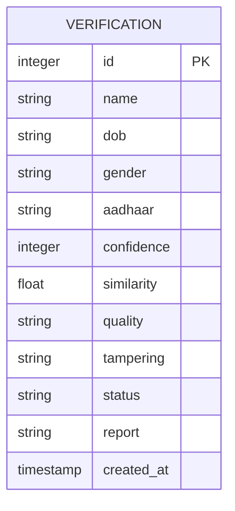
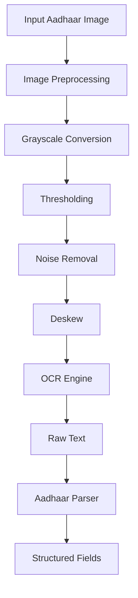
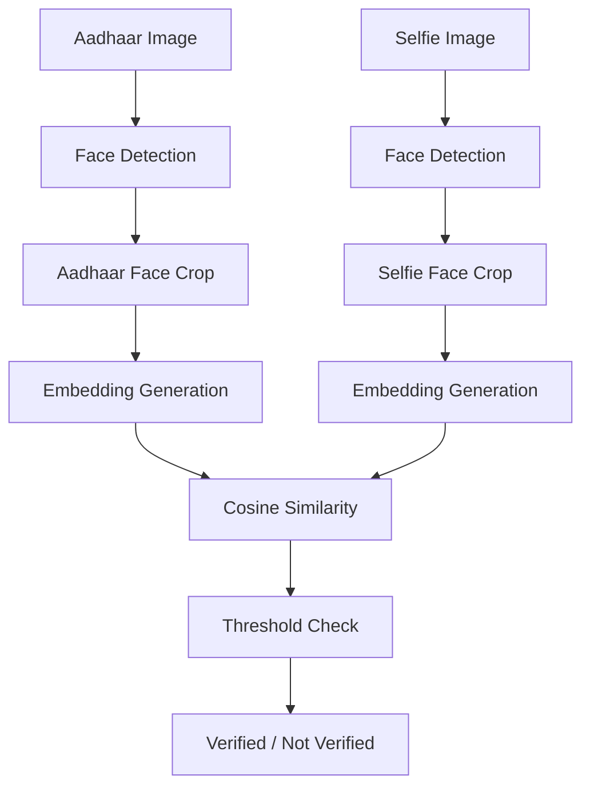

# PRAMAN - AI Powered Aadhaar Verification System

> **A production-minded Aadhaar document verification platform powered by OCR, face verification, image forensics, confidence scoring, PDF reporting, and FastAPI.**

<p align="center">
  
  
  
  
  
  
  
</p>

<p align="center">
  <b>OCR</b> •
  <b>Aadhaar Data Extraction</b> •
  <b>Face Verification</b> •
  <b>Image Quality Analysis</b> •
  <b>Tampering Detection</b> •
  <b>PDF Reports</b> •
  <b>Verification History</b>
</p>

---

## Table of Contents

- [Project Description](#project-description)
- [Why PRAMAN Exists](#why-praman-exists)
- [Real-World Use Cases](#real-world-use-cases)
- [Feature Matrix](#feature-matrix)
- [System Architecture](#system-architecture)
- [Verification Workflow](#verification-workflow)
- [Folder Structure](#folder-structure)
- [Module Description](#module-description)
- [API Endpoints](#api-endpoints)
- [Installation](#installation)
- [Usage](#usage)
- [Screenshots](#screenshots)
- [Database Schema](#database-schema)
- [Confidence Calculation](#confidence-calculation)
- [Tampering Detection](#tampering-detection)
- [OCR Pipeline](#ocr-pipeline)
- [Face Verification Pipeline](#face-verification-pipeline)
- [Performance](#performance)
- [Security](#security)
- [Testing](#testing)
- [Future Improvements](#future-improvements)
- [License](#license)
- [Author](#author)

---

## Project Description

**PRAMAN** is an AI-powered Aadhaar verification system designed to validate Aadhaar card submissions using a multi-stage verification pipeline.

It combines **document OCR**, **structured data extraction**, **face matching**, **image quality analysis**, **tampering detection**, **confidence scoring**, **database logging**, and **PDF report generation** into a single FastAPI application.

The system accepts an Aadhaar card image and a selfie image, processes both through independent verification modules, calculates a final confidence score, stores the verification record, and returns a structured API response with a downloadable report path.

PRAMAN is built with a pragmatic stack:

- **FastAPI** for the REST API.
- **OpenCV** for image analysis and preprocessing.
- **OCR tooling** for text extraction from Aadhaar images.
- **InsightFace** for face verification.
- **SQLite** for lightweight local persistence.
- **HTML, CSS, and JavaScript** for a simple frontend.
- **PDF generation utilities** for verification reports.

---

## Why PRAMAN Exists

Manual identity document checks are slow, inconsistent, and difficult to audit.

PRAMAN exists to make Aadhaar verification:

- **Faster** through automated OCR and face matching.
- **More consistent** through rule-based scoring.
- **More auditable** through database history and generated reports.
- **More transparent** through module-level outputs.
- **More developer-friendly** through a clean REST API.

The goal is not to replace compliance review in high-risk environments, but to provide a strong automated screening layer that can support onboarding, internal verification workflows, and document quality checks.

---

## Real-World Use Cases

PRAMAN can be adapted for:

- Customer onboarding workflows.
- KYC pre-verification systems.
- Internal identity review tools.
- Aadhaar document quality screening.
- Selfie-to-document face comparison.
- Verification audit trail generation.
- Prototype identity verification research.
- Educational computer vision and OCR projects.
- Backend API demonstrations for AI-powered document processing.

---

## Feature Matrix

| Feature | Description | Status |
| --- | --- | --- |
| 🔎 OCR | Extracts text from Aadhaar card images. | Supported |
| 🧾 Aadhaar Data Extraction | Parses name, DOB, gender, and Aadhaar number from OCR output. | Supported |
| 🙂 Face Verification | Compares Aadhaar photo with uploaded selfie. | Supported |
| 🖼️ Image Quality | Checks blur, brightness, contrast, and overall image usability. | Supported |
| 🛡️ Tampering Detection | Detects possible manipulation signals using image forensics. | Supported |
| 📊 Confidence Score | Converts module results into a final verification score. | Supported |
| 📄 PDF Report | Generates a verification report for audit and download. | Supported |
| 🗃️ SQLite Storage | Stores verification records locally. | Supported |
| 🕘 History | Returns past verification attempts through an API endpoint. | Supported |
| ⚡ Swagger API | FastAPI automatically exposes interactive API docs. | Supported |
| 🌐 Frontend | Simple HTML, CSS, and JavaScript interface. | Supported |
| 🧩 AVIF Support | Can be extended with Pillow AVIF plugin for modern image formats. | Planned / Configurable |

---

## System Architecture



---

## Verification Workflow



---

## Folder Structure

```text
PRAMAN/
├── app/
│   ├── Configuration/
│   │   └── config.py
│   ├── database/
│   │   └── database.py
│   ├── routes/
│   │   ├── face.py
│   │   ├── history.py
│   │   ├── ocr.py
│   │   ├── quality.py
│   │   ├── tampering.py
│   │   └── verify.py
│   ├── services/
│   │   ├── __init__.py
│   │   ├── aadhaar_parser.py
│   │   ├── document_detector.py
│   │   ├── face_service.py
│   │   ├── Image_enhancement.py
│   │   ├── Image_quality.py
│   │   ├── ocr_service.py
│   │   ├── Preprocesser.py
│   │   ├── report_service.py
│   │   └── tampering_service.py
│   ├── utils/
│   │   ├── haarcascade_frontalface_default.xml
│   │   ├── Image_utils.py
│   │   └── pdf_report.py
│   └── main.py
├── database/
│   └── praman.db
├── frontend/
│   ├── index.html
│   ├── script.js
│   └── style.css
├── logs/
├── processed/
│   └── .gitkeep
├── reports/
│   ├── report_*.pdf
│   └── verification_report.json
├── uploads/
│   └── .gitkeep
├── logger.py
├── requirements.txt
├── run.py
├── LICENSE
├── README.md
├── .gitignore
├── test_document.py
├── test_enhancement.py
├── test_face.py
├── test_ocr.py
├── test_parser.py
├── test_preprocessor.py
├── test_quality.py
├── test_report.py
└── test_tampering.py
```

---

## Module Description

| Module | Purpose | Technology Used |
| --- | --- | --- |
| OCR | Extracts raw text from Aadhaar card images. | OCR engine, OpenCV, NumPy |
| Parser | Converts unstructured OCR text into Aadhaar fields. | Python, regex/string parsing |
| Face | Compares Aadhaar face with selfie image. | InsightFace, OpenCV, embeddings |
| Quality | Scores blur, brightness, contrast, and readability. | OpenCV, NumPy |
| Tampering | Checks suspicious image manipulation patterns. | OpenCV, image forensics |
| Database | Stores verification history and report metadata. | SQLite |
| Frontend | Provides a simple upload and result viewing UI. | HTML, CSS, JavaScript |
| API | Exposes verification modules through REST endpoints. | FastAPI, Uvicorn |
| PDF | Builds downloadable verification reports. | PDF generation utility |

---

## API Endpoints

### Core Endpoints

| Method | Endpoint | Description |
| --- | --- | --- |
| GET | `/` | Health check for the PRAMAN API. |
| POST | `/verify` | Runs the complete Aadhaar verification workflow. |
| GET | `/history` | Returns previous verification records. |

### Module Endpoints

| Method | Endpoint | Description |
| --- | --- | --- |
| POST | `/ocr/` | Extracts OCR text from an uploaded Aadhaar image. |
| POST | `/face/` | Compares Aadhaar image face against a selfie. |
| POST | `/quality/` | Runs image quality analysis on an uploaded image. |
| POST | `/tampering/` | Runs tampering detection on an uploaded image. |

### API Documentation

FastAPI automatically generates interactive API documentation:

| Documentation | URL |
| --- | --- |
| Swagger UI | `http://127.0.0.1:8000/docs` |
| ReDoc | `http://127.0.0.1:8000/redoc` |
| OpenAPI JSON | `http://127.0.0.1:8000/openapi.json` |

---

## Request Examples

### Health Check

```bash
curl http://127.0.0.1:8000/
```

Expected response:

```json
{
  "status": "success",
  "message": "PRAMAN API is running"
}
```

### Complete Verification

```bash
curl -X POST "http://127.0.0.1:8000/verify" \
  -F "aadhaar=@sample-aadhaar.jpg" \
  -F "selfie=@sample-selfie.jpg"
```

### OCR Only

```bash
curl -X POST "http://127.0.0.1:8000/ocr/" \
  -F "image=@sample-aadhaar.jpg"
```

### Face Verification Only

```bash
curl -X POST "http://127.0.0.1:8000/face/" \
  -F "aadhaar=@sample-aadhaar.jpg" \
  -F "selfie=@sample-selfie.jpg"
```

### Tampering Detection Only

```bash
curl -X POST "http://127.0.0.1:8000/tampering/" \
  -F "image=@sample-aadhaar.jpg"
```

### Verification History

```bash
curl http://127.0.0.1:8000/history
```

---

## Installation

### Prerequisites

Make sure the following are installed:

- Python 3.9 or newer.
- pip.
- Git.
- A modern browser.
- Optional: GPU runtime support for faster deep learning inference.

---

### Windows Setup

```powershell
git clone https://github.com/your-username/PRAMAN.git
cd PRAMAN
python -m venv .venv
.\.venv\Scripts\activate
python -m pip install --upgrade pip
pip install -r requirements.txt
python run.py
```

The API will start at:

```text
http://127.0.0.1:8000
```

---

### Linux Setup

```bash
git clone https://github.com/your-username/PRAMAN.git
cd PRAMAN
python3 -m venv .venv
source .venv/bin/activate
python -m pip install --upgrade pip
pip install -r requirements.txt
python run.py
```

The API will start at:

```text
http://127.0.0.1:8000
```

---

### Run With Uvicorn Directly

```bash
uvicorn app.main:app --host 127.0.0.1 --port 8000 --reload
```

Use `--reload` during development.

Use a process manager or container runtime for production deployments.

---

### Run Frontend

The frontend is located in:

```text
frontend/
```

You can open `frontend/index.html` directly in a browser for simple local testing.

For a better development experience, serve it using a lightweight static server:

```bash
cd frontend
python -m http.server 5500
```

Then open:

```text
http://127.0.0.1:5500
```

The backend CORS configuration allows:

```text
http://localhost:5500
http://127.0.0.1:5500
```

---

## Usage

### Step 1: Start the Backend

```bash
python run.py
```

Confirm the API is running:

```text
http://127.0.0.1:8000/
```

---

### Step 2: Open the Frontend

Open:

```text
frontend/index.html
```

Or use a local static server:

```bash
cd frontend
python -m http.server 5500
```

---

### Step 3: Upload Aadhaar Image

Choose a clear image of the Aadhaar card.

Recommended image qualities:

- Good lighting.
- Straight document angle.
- No heavy blur.
- No cropped edges.
- Visible face region.
- Visible Aadhaar number and demographic fields.

---

### Step 4: Upload Selfie Image

Choose a selfie image for face comparison.

Recommended selfie qualities:

- Frontal face.
- Good lighting.
- No sunglasses or heavy occlusion.
- Single person in the frame.
- Similar age range to Aadhaar card photo where possible.

---

### Step 5: Click Verify

PRAMAN runs:

- Image quality analysis.
- OCR extraction.
- Aadhaar field parsing.
- Face verification.
- Tampering detection.
- Confidence score calculation.
- PDF report generation.
- Database storage.

---

### Step 6: View Results

The API response includes:

- Final status.
- Confidence score.
- Image quality report.
- OCR output.
- Parsed Aadhaar fields.
- Face verification result.
- Tampering detection result.
- PDF report path.

---

### Step 7: Download PDF Report

Generated reports are stored inside:

```text
reports/
```

Each report can be used for review, audit, or workflow handoff.

---

## Screenshots

> Add project screenshots in a `docs/screenshots/` directory and update these placeholders.

### Dashboard

```text
docs/screenshots/dashboard.png
```

### Swagger API

```text
docs/screenshots/swagger.png
```

### Verification Result

```text
docs/screenshots/verification-result.png
```

### PDF Report

```text
docs/screenshots/pdf-report.png
```

### History

```text
docs/screenshots/history.png
```

### Frontend

```text
docs/screenshots/frontend.png
```

---

## Database Schema

PRAMAN uses SQLite for local verification history.

Default database path:

```text
database/praman.db
```

### ER Diagram



### Verification Table

| Column | Type | Description |
| --- | --- | --- |
| `id` | INTEGER | Auto-incrementing primary key. |
| `name` | TEXT | Parsed Aadhaar holder name. |
| `dob` | TEXT | Parsed date of birth. |
| `gender` | TEXT | Parsed gender. |
| `aadhaar` | TEXT | Parsed Aadhaar number. |
| `confidence` | INTEGER | Final verification confidence score. |
| `similarity` | REAL | Face similarity score. |
| `quality` | TEXT | Image quality status. |
| `tampering` | TEXT | Tampering flag as stored text. |
| `status` | TEXT | Final PASS or FAIL status. |
| `report` | TEXT | Generated PDF report path. |
| `created_at` | TIMESTAMP | Verification creation time. |

---

## Confidence Calculation

PRAMAN starts each verification at a perfect score and subtracts weighted penalties for failed checks.

### Default Formula

```text
Start Score = 100

Poor Image Quality      = -20
Face Verification Fail  = -30
Tampering Detected      = -20
Missing Aadhaar Number  = -15
Missing Name            = -15

Final Confidence = max(score, 0)
Status = PASS if confidence > 60 else FAIL
```

### Example

| Check | Result | Penalty |
| --- | --- | --- |
| Starting score | Passed | 0 |
| Image quality | FAIL | -20 |
| Face verification | PASS | 0 |
| Tampering | Not detected | 0 |
| Aadhaar number | Present | 0 |
| Name | Missing | -15 |
| Final score | 65 | PASS |

### Interpretation

| Confidence Range | Meaning | Suggested Action |
| --- | --- | --- |
| 90-100 | Strong verification | Accept or auto-approve. |
| 75-89 | Good verification | Accept with low review priority. |
| 61-74 | Borderline pass | Manual review recommended. |
| 40-60 | Weak verification | Manual review required. |
| 0-39 | High-risk submission | Reject or request resubmission. |

---

## Tampering Detection

Tampering detection checks whether the submitted Aadhaar image contains signals that may indicate manipulation.

PRAMAN can inspect:

- Noise inconsistencies.
- Edge density anomalies.
- Sharpness differences.
- Copy-move artifacts.
- Compression artifacts.
- Metadata inconsistencies.
- Region-level visual irregularities.

### Techniques

| Technique | Purpose |
| --- | --- |
| Noise Analysis | Detects unnatural noise distribution across image regions. |
| Edge Density | Finds suspiciously edited or pasted boundaries. |
| Sharpness Analysis | Flags inconsistent blur between document regions. |
| Copy-Move Detection | Identifies duplicated regions within the image. |
| Metadata Validation | Checks file metadata for suspicious signals. |
| Compression Inspection | Looks for inconsistent JPEG compression artifacts. |

### Output

The tampering module returns structured output that can include:

- Boolean tampered flag.
- Risk score.
- Diagnostic details.
- Module-level status.

---

## OCR Pipeline

OCR is responsible for extracting readable text from Aadhaar card images.

### Pipeline



### Preprocessing Steps

| Step | Purpose |
| --- | --- |
| Grayscale | Reduces image complexity before OCR. |
| Thresholding | Improves text/background separation. |
| Deskew | Corrects tilted document images. |
| Noise Removal | Removes small artifacts that affect recognition. |
| Contrast Enhancement | Improves readability of low-contrast text. |
| Region Extraction | Focuses OCR on document-relevant areas. |

### Parsed Fields

PRAMAN attempts to extract:

- Name.
- Date of birth.
- Gender.
- Aadhaar number.

---

## Face Verification Pipeline

Face verification compares the portrait on the Aadhaar card against the uploaded selfie.



### How It Works

1. Detect a face in the Aadhaar image.
2. Detect a face in the selfie.
3. Generate a numerical embedding for each face.
4. Compare embeddings using cosine similarity.
5. Mark the face check as verified when similarity crosses the configured threshold.

### Output

| Field | Description |
| --- | --- |
| `verified` | Boolean face verification result. |
| `similarity` | Similarity score between Aadhaar face and selfie. |
| `message` | Optional explanation or diagnostic message. |

---

## Image Quality Analysis

Quality analysis helps reject images that are unlikely to produce reliable verification results.

### Quality Signals

| Signal | Description |
| --- | --- |
| Blur | Detects whether text and face regions are too soft. |
| Brightness | Checks underexposed or overexposed submissions. |
| Contrast | Measures text/document separation quality. |
| Resolution | Ensures the image has enough detail. |
| Document Visibility | Checks whether the Aadhaar card is visible enough. |
| Face Visibility | Helps downstream face matching reliability. |

### Why Quality Matters

Poor image quality can cause:

- OCR failure.
- Incorrect Aadhaar parsing.
- False face mismatch.
- False tampering signals.
- Low confidence score.

---

## PDF Report Generation

PRAMAN generates a PDF report after complete verification.

The report can include:

- Verification status.
- Confidence score.
- Parsed Aadhaar fields.
- Image quality result.
- Face verification result.
- Tampering detection result.
- Report timestamp.
- Audit metadata.

Generated reports are stored in:

```text
reports/
```

---

## API Response Shape

A complete verification response follows this general structure:

```json
{
  "status": "PASS",
  "confidence": 85,
  "image_quality": {
    "status": "PASS"
  },
  "ocr": {
    "text": "..."
  },
  "aadhaar": {
    "name": "Example Name",
    "dob": "01/01/1990",
    "gender": "Male",
    "aadhaar_number": "1234 5678 9012"
  },
  "face": {
    "verified": true,
    "similarity": 0.82
  },
  "tampering": {
    "tampered": false
  },
  "pdf_report": "reports/report_YYYYMMDD_HHMMSS.pdf"
}
```

---

## Performance

PRAMAN is designed to be usable on a standard CPU while still benefiting from GPU acceleration when available.

### Runtime Characteristics

| Component | Notes |
| --- | --- |
| FastAPI | High-performance async API framework. |
| OpenCV | Efficient CPU-based computer vision operations. |
| OCR | Can be CPU-heavy depending on selected OCR engine. |
| InsightFace | Benefits significantly from GPU acceleration. |
| SQLite | Lightweight local storage suitable for development and small deployments. |
| PDF Generation | Fast for typical single-verification reports. |

### CPU Compatibility

PRAMAN can run on CPU-only machines.

CPU inference may be slower for:

- OCR.
- Face embedding generation.
- Image enhancement.
- Deep learning based checks.

### GPU Support

GPU acceleration can improve:

- Face detection.
- Face embedding extraction.
- OCR inference.
- Image enhancement.

Install the correct runtime packages for your GPU, CUDA version, and inference backend.

---

## Security

Identity verification systems handle sensitive personal data.

PRAMAN should be deployed with careful security controls before production use.

### Current Security Measures

| Area | Practice |
| --- | --- |
| Input Validation | API endpoints accept explicit uploaded files. |
| Image Type Validation | Recommended before production deployment. |
| Confidence Score | Provides explainable risk output. |
| Database Logging | Stores verification history for auditability. |
| PDF Reports | Preserves verification results for review. |
| CORS | Restricts local frontend origins during development. |

### Production Security Recommendations

- Add strict file extension validation.
- Add MIME type validation.
- Limit upload size.
- Sanitize uploaded filenames.
- Store files with generated UUID names.
- Encrypt sensitive data at rest.
- Add authentication and authorization.
- Add JWT or session-based access control.
- Avoid exposing uploaded identity images publicly.
- Add audit logs for admin actions.
- Add rate limiting.
- Add malware scanning for uploads.
- Use HTTPS in every deployment.
- Add retention and deletion policies for Aadhaar data.

### Privacy Notice

PRAMAN processes identity documents and face images.

Before using it with real users:

- Obtain explicit consent.
- Follow applicable privacy laws.
- Minimize stored personal data.
- Provide deletion workflows.
- Restrict access to verification records.
- Do not use sample or production Aadhaar images in public repositories.

---

## Testing

The repository includes focused test files for core modules.

```text
test_document.py
test_enhancement.py
test_face.py
test_ocr.py
test_parser.py
test_preprocessor.py
test_quality.py
test_report.py
test_tampering.py
```

Run tests with:

```bash
pytest
```

Run a specific test file:

```bash
pytest test_ocr.py
```

---

## Development Notes

### Recommended Local Workflow

```bash
python -m venv .venv
source .venv/bin/activate
pip install -r requirements.txt
uvicorn app.main:app --reload
pytest
```

On Windows PowerShell:

```powershell
python -m venv .venv
.\.venv\Scripts\activate
pip install -r requirements.txt
uvicorn app.main:app --reload
pytest
```

### Generated Directories

The following directories may contain runtime artifacts:

| Directory | Purpose |
| --- | --- |
| `uploads/` | Uploaded Aadhaar and selfie files. |
| `processed/` | Processed intermediate image files. |
| `reports/` | Generated PDF and JSON reports. |
| `database/` | SQLite database file. |
| `logs/` | Application logs. |

Avoid committing sensitive generated files.

---

## Configuration

Configuration can be centralized in:

```text
app/Configuration/config.py
```

Common values to configure:

- Upload directory.
- Report directory.
- Database path.
- Face similarity threshold.
- OCR language settings.
- Maximum file size.
- Allowed file types.
- Logging level.
- CORS origins.

---

## Supported Image Formats

PRAMAN is designed for common document image formats.

Recommended:

- JPG.
- JPEG.
- PNG.
- WEBP.

Optional:

- AVIF through `pillow-avif-plugin`.

For AVIF support, install:

```bash
pip install pillow-avif-plugin
```

Then register the plugin in the image loading path where needed.

---

## Future Improvements

| Improvement | Description |
| --- | --- |
| QR Verification | Decode and verify Aadhaar secure QR data. |
| Digital Signature Verification | Validate digitally signed Aadhaar artifacts. |
| Deepfake Detection | Detect synthetic or manipulated selfie images. |
| Liveness Detection | Require live selfie or video verification. |
| Docker | Add containerized development and deployment. |
| Cloud Deployment | Deploy on AWS, Azure, GCP, or Render. |
| JWT Authentication | Protect API endpoints with token-based auth. |
| Admin Dashboard | Add role-based verification review dashboard. |
| Queue Processing | Process heavy verification jobs asynchronously. |
| Object Storage | Store uploads and reports in S3-compatible storage. |
| Better File Security | Add UUID filenames, MIME validation, and upload scanning. |
| Report Templates | Add customizable PDF templates. |
| Metrics | Add Prometheus or OpenTelemetry instrumentation. |
| CI/CD | Add GitHub Actions for linting and tests. |

---

## Roadmap

### Phase 1: Core Verification

- Aadhaar image upload.
- Selfie image upload.
- OCR extraction.
- Aadhaar field parsing.
- Face verification.
- Quality analysis.
- Tampering detection.
- Confidence score.
- PDF report.
- SQLite history.

### Phase 2: Reliability

- Better exception handling.
- Upload file validation.
- Configurable thresholds.
- Improved parser accuracy.
- More complete test coverage.
- Report template cleanup.

### Phase 3: Production Readiness

- Authentication.
- Role-based access.
- Docker.
- Queue workers.
- Secure storage.
- Audit logs.
- Deployment documentation.

### Phase 4: Advanced Identity Signals

- Aadhaar QR validation.
- Liveness detection.
- Deepfake detection.
- Device fingerprinting.
- Duplicate user detection.

---

## Limitations

PRAMAN is an AI-assisted verification system.

It may produce incorrect results when:

- The Aadhaar image is blurry.
- The document is cropped.
- The selfie has poor lighting.
- The Aadhaar photo is old or low-quality.
- OCR fails on complex backgrounds.
- The document has heavy compression artifacts.
- The submitted file is intentionally manipulated.

For high-risk or regulated workflows, use PRAMAN as a screening layer with human review and official verification sources.

---

## Compliance Considerations

Before using PRAMAN with real Aadhaar data:

- Review applicable laws and regulations.
- Obtain user consent.
- Clearly state how data is processed.
- Store only necessary information.
- Add data deletion workflows.
- Secure uploads and reports.
- Restrict internal access.
- Avoid logging raw identity data unnecessarily.

---

## Contributing

Contributions are welcome.

Recommended contribution areas:

- OCR accuracy improvements.
- Aadhaar parser robustness.
- Tampering detection algorithms.
- Better frontend UX.
- Test coverage.
- API validation.
- Docker support.
- Documentation.
- Security hardening.

### Development Checklist

- Create a feature branch.
- Keep changes focused.
- Add or update tests.
- Run `pytest`.
- Update documentation when behavior changes.
- Avoid committing generated identity documents or reports.

---

## FAQ

<details>
<summary><b>Does PRAMAN verify Aadhaar against an official government database?</b></summary>

No. PRAMAN performs local document, image, OCR, and face verification checks. Official Aadhaar verification requires authorized integrations and compliance with applicable regulations.

</details>

<details>
<summary><b>Can PRAMAN run without a GPU?</b></summary>

Yes. PRAMAN can run on CPU, but OCR and face verification may be slower compared with GPU-backed inference.

</details>

<details>
<summary><b>Where are reports stored?</b></summary>

Generated reports are stored in the `reports/` directory.

</details>

<details>
<summary><b>Where is verification history stored?</b></summary>

Verification records are stored in the SQLite database at `database/praman.db`.

</details>

<details>
<summary><b>Can I use AVIF images?</b></summary>

AVIF support can be enabled through `pillow-avif-plugin` and compatible image loading logic.

</details>

<details>
<summary><b>Is this production-ready?</b></summary>

PRAMAN is a strong project foundation. Before production use, add authentication, file validation, encryption, retention policies, rate limits, monitoring, secure deployment, and legal review.

</details>

---

## License

This project is licensed under the **MIT License**.

See [LICENSE](LICENSE) for details.

---

## 👤 Author

**Abhishek Khopade**

Aspiring **ML Engineer | MLOps | LLMOps**

🔗 GitHub:
[https://github.com/ABHISHEKKHOPADE](https://github.com/ABHISHEKKHOPADE)

---

## Acknowledgements

PRAMAN is built with open source technologies from the Python, FastAPI, computer vision, OCR, and machine learning communities.

Key ecosystem tools include:

- FastAPI.
- Uvicorn.
- OpenCV.
- NumPy.
- Pillow.
- InsightFace.
- OCR engines.
- SQLite.
- Report generation libraries.

---

<p align="center">
  <b>PRAMAN</b><br>
  AI Powered Aadhaar Verification System
</p>
